## 쉐어트리츠 사전과제

-----------------------

### 개발 환경

------------

Java 17 
Lombok

테스트를 위한

 - Junit
 - AssertJ
 - Mockito

### 사전과제 

### 공통사항
[사전과제 링크](https://replit.com/@ujuj0202/ShareTreatsPreAssignment-1?v=1)

EXCHANGEGOODS, HEADCOUNTOFDEPT, PACHINKOGOODS 명령어를 통해 원하는 서비스를 실행 할 수 있습니다.

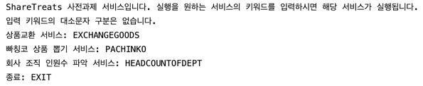

-----------

### 상품교환 서비스 

------------

**동작 설명**

초기화면에서 exchangegoods 명령어를 통해 상품교환 서비스를 실행 할 수 있습니다.

이후 help(서비스 이용방법 안내), check(상품코드의 유효 판단), claim(상품교환) 명령어로 작동합니다.

Goods는 상품코드와 상품교환 상태를 가지고 있는 클래스입니다.

Store는 교환한 상품코드 목록을 가지고 있는 클래스입니다.

서비스에 들어오는 입력은 `ExchangeGoodsInputValidator`를 통해 초기 입력에 문제가 없는지 판단합니다.

입력에 문제가 없다면 명령어에 따라서 해당 서비스가 작동되고 명령어에 따라 작동될 서비스는 커맨드 패턴을 사용해서 처리했습니다.

`ExchangeGoodsCommandManager`는 실행될 커맨드들을 관리하는 클래스고 해당 클래스를 통해 커맨드가 실행되어 결과값을 반환합니다.

**테스트 케이스**

명령어 입력이 없거나, 공백으로만 되어있는 경우 InvalidInputException 발생 아무런 입력이 없습니다. 원하는 요청을 입력해주세요 메세지 출력

잘못된 명령어를 입력할 경우 InvalidInputException 발생 후 메세지 출력.

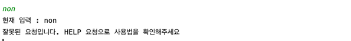

입력이 30글자가 초과될 경우 InvalidInputException 발생 후 메세지 출력.

----------------

**CHECK**

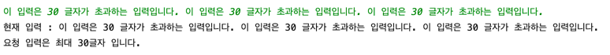

상품 코드가 없는 check 입력할 경우 InvalidInputException 발생 후 메세지 출력.

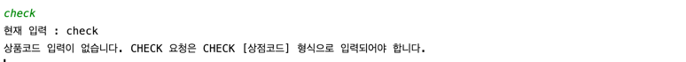

9자리 이하의 상품 코드로 check 입력할 경우 InvalidInputException 발생 후 메세지 출력.

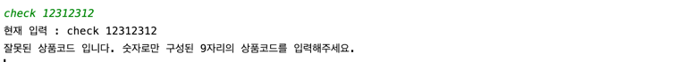

숫자문자열이 아닌 상품 코드로 check 입력할 경우 InvalidInputException 발생 후 메세지 출력.

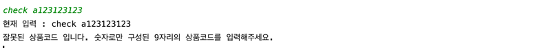

한번에 여러개의 상품 코드로 check 입력할 경우 InvalidInputException 발생 후 메세지 출력.

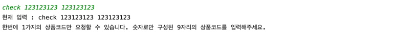

제공되어있지 않는 상품 코드로 check 할 경우 InvalidGoodsCodeException 예외 발생.

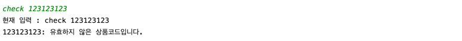

이미 교환된 상품 코드로 check 할 경우 교환되었다는 메세지 출력.

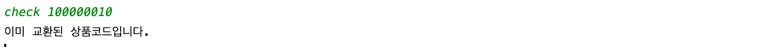

교환되지 않은 상품코드로 check 할 경우 교환 가능하다는 메세지 출력.

----------------------------

**HELP**

HELP 입력할 경우 안내문 출력.

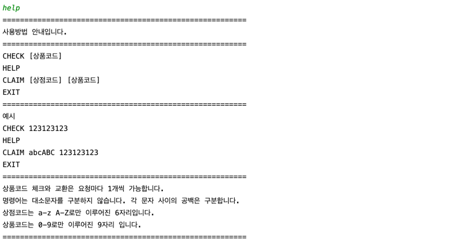

-----------------

**CLAIM**

상품 코드와 상점 코드가 없는 claim 입력할 경우 InvalidInputException 발생 후 메세지 출력.

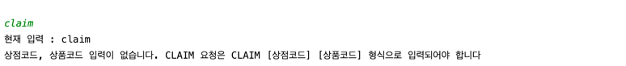

상품 코드가 없는 claim 입력할 경우 InvalidInputException 발생 후 메세지 출력.

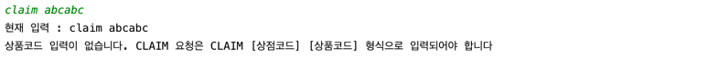

9자리 이하인 상품 코드 claim 입력할 경우 InvalidInputException 발생 후 메세지 출력.

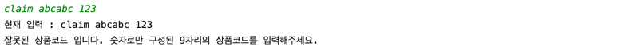

숫자 문자열이 아닌 상품 코드 claim 입력할 경우 InvalidInputException 발생 후 메세지 출력.

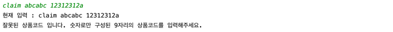

6자리 이하인 상점 코드 claim 입력할 경우 InvalidInputException 발생 후 메세지 출력.

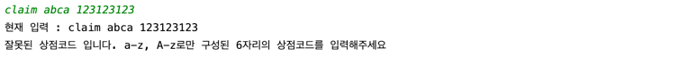

영어 문자열이 아닌 상점 코드 claim 입력할 경우 InvalidInputException 발생 후 메세지 출력.

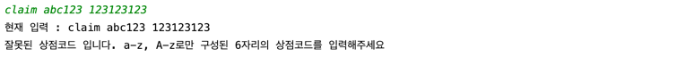

한번에 여러개의 상품 코드로 claim 입력할 경우 InvalidInputException 발생 후 메세지 출력.

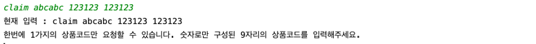

제공되어있지 않는 코드로 claim 할 경우 InvalidGoodsCodeException 예외 발생.

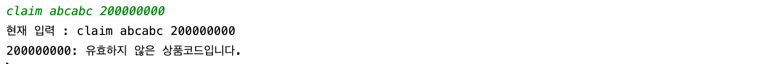

교환되지 않은 상품코드와 형식에 맞는 상점코드로 claim 할 경우 상품교환을 진행하고 교환 메세지 출력.

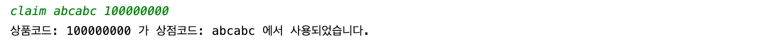

이미 교환된 상품 코드로 claim 할 경우 교환되었다는 메세지 출력.

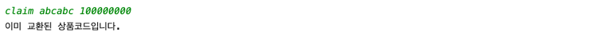

-----------------

### 빠칭코 상품 뽑기 서비스

-------------------

### 회사 조직(부서) 인원수 파악 서비스

